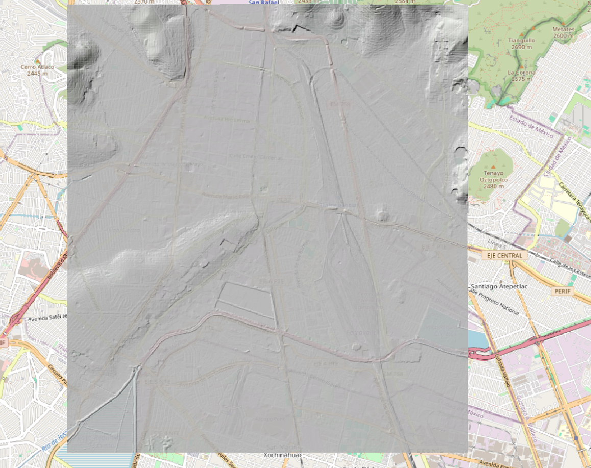

# TopoDataDowloader 
#### Cuando necesitas descargar una gran cantidad de Modelos Digitales de Elevación (DEM) a escala 1:10,000 desde la página de [INEGI](https://www.inegi.org.mx/), como en procesos hidrológicos, puede ser una tarea que consume mucho tiempo. Este proyecto es un primer paso hacia la automatización de este proceso. 




Actualmente, esta implementación solo abarca la escala 1:10,000; más adelante se agregarán otras escalas.

## Funcionamiento 
El funcionamiento de estos scripts es muy sencillo, ya que replican el proceso realizado en la página oficial de INEGI. 
La página de INEGI realiza una consulta POST para cada DEM según las cartas correspondientes de la escala seleccionada. La URL utilizada es la siguiente:

```HTTP
POST https://www.inegi.org.mx/app/api/productos/interna_v2/componente/mapas/lista/resultados/
```

El cuerpo de la solicitud es algo así, donde el parámetro clave es precisamente la clave de la carta:
``` json 
{
    "muni": "",
    "loca": "",
    "tema": "193",
    "titg": "",
    "esca": 8,
    "form": "",
    "edic": "",
    "seri": "",
    "clave": "e14a39a2",
    "rango": "",
    "busc": "",
    "tipoB": 2,
    "adv": false,
    "wordag": "",
    "mkeys": "",
    "mageo": "",
    "formIncl": "",
    "formExcl": "",
    "orden": 4,
    "desc": true,
    "pag": 0,
    "tam": 10
}
```
El resultado de la solicitud anterior será un JSON. En el campo "mapas", se encontrará una lista de todos los DEM disponibles para esa carta. A continuación se muestra un ejemplo de uno de los elementos incluidos en el campo "mapas":

```json
      {
          "key": "889463843139",
          "titulo": "Modelo digital de elevación de tipo superficie con resolución de 1.5 metros generado a partir de datos de altimetría del relieve. E14A39a2",
          "titulo_ing": "",
          "entidad": "México",
          "url": "/app/biblioteca/ficha.html?upc=889463843139",
          "edicion": 2020,
          "formatos": [
              {
                  "upc": "889463843139",
                  "imagen": "/img/ico/ico_bil.png",
                  "siglas": "MB",
                  "absoluto": "",
                  "dominio": null,
                  "folder": null,
                  "extension": "BIL",
                  "datos_abiertos": "",
                  "clave": 3,
                  "peso": 49.03,
                  "origen": 1,
                  "web": false,
                  "control": false,
                  "url": {
                      "valor": "/contenidos/productos/prod_serv/contenidos/espanol/bvinegi/productos/geografia/imagen_cartografica/1_10_000/lidar/1_5m/Superficie/889463843139_b.zip",
                      "target": "_blank",
                      "estilo": ""
                  },
                  "adicional": {
                      "estilo": "margin-right:10px;"
                  }
            }
  }
```
Cada uno de los campos dentro de "mapas" contendrá una serie de registros que describen el tipo de modelos (ya sea DEM del terreno o de la superficie), la edición, los formatos disponibles, así como la URL para la descarga. 

De este modo, el enlace para descargar el DEM de superficie del año 2020 en formato BIL sería:

```HTTP
https://www.inegi.org.mx/contenidos/productos/prod_serv/contenidos/espanol/bvinegi/productos/geografia/imagen_cartografica/1_10_000/lidar/1_5m/Superficie/889463843139_b.zip
```
### Configuración del Proyecto con Pipenv

Este proyecto se ha desarrollado utilizando **pipenv** como herramienta de gestión de entornos virtuales. Siga estos pasos para comenzar:

#### 1. Clonar este repositorio:

```bash
git clone https://github.com/hermiganes/topo_data_downloader.git
```
#### 2. Creación del Ambiente Virtual con Pipenv:
Para crear y activar el entorno virtual con Pipenv, ejecute los siguientes comandos en la raíz del repositorio clonado:

 ```bash
cd topo_data_downloader  # Cambiar al directorio clonado
pipenv install --dev  # Instala las dependencias del proyecto
pipenv shell  # Activa el entorno virtual
```


## Ejemplo de Aplicación 
Dentro de este mismo repositorio se encuentra un Jupyter Notebook llamado [example.ipynb](https://github.com/hermiganes/topo_data_downloader/blob/main/example.ipynb), el cual muestra un ejemplo de aplicación para descargar los DEMs de la CDMX.

En resumen, el proceso incluye la intersección del shape de la CDMX con el shape de las cartas 1:10,000, disponible en [div10k](https://github.com/hermiganes/topo_data_downloader/tree/main/inputs), seguido de la descarga de los DEMs.


